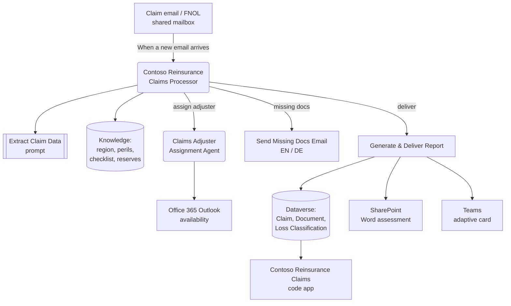

# Contoso Reinsurance Claims Processor — Solution Accelerator

An autonomous **Microsoft Copilot Studio** agent that turns inbound claims‑notification
(FNOL) emails into structured, triaged claim records for a German‑market reinsurer. It
extracts the loss details, detects the German federal state and the language of the
message, classifies the cause of loss, checks the documents against a checklist,
estimates a fast‑track reserve, assigns a claims adjuster, writes everything to Dataverse,
generates a Word assessment to SharePoint, and posts an adaptive card to Teams.

This repository ships the whole thing as a **single unmanaged Power Platform solution**
plus the setup documentation you need to stand it up in your own environment.

> Built for **Contoso Reinsurance**. The agent converses in English; the source claims it
> reads can be in German or English. Regions are German *Bundesländer*, reserves are in EUR.

---

## What you get

| Component | Name | Notes |
| --- | --- | --- |
| Agent | **Contoso Reinsurance Claims Processor** | Orchestrates the end‑to‑end claim triage |
| Sub‑agent | **Claims Adjuster Assignment Agent** | Picks an adjuster by caseload, region and Outlook availability |
| Prompt / AI model | **Extract Claim Data** | Structured extraction from the raw email |
| Cloud flow | **Generate & Deliver Report** | Word report → SharePoint, adaptive card → Teams, rows → Dataverse |
| Cloud flow | **Send Missing Docs Email** | Bilingual (EN/DE) request for missing documents |
| Trigger flow | **When a new email arrives (shared mailbox)** | Added during setup against your claims shared mailbox |
| Table | **Claim** (`uw_submission`) | One row per claim, with a `Case ID` alternate key (`CLM-…`) |
| Table | **Claim Document** (`uw_submissiondocument`) | Child rows, one per provided/missing document |
| Table | **Loss Classification** (`uw_classificationmatch`) | Child rows, top‑3 cause‑of‑loss matches |
| Knowledge | 6 Word documents | Region map, adjuster table, cause‑of‑loss reference, document checklist, reserve rules |
| Code app | **Contoso Reinsurance Claims** | React + TypeScript adjuster workbench over the three tables (in [`/app`](./app)) |

The solution zip is in [`/solution`](./solution); the code‑app source is in [`/app`](./app).

---

## Architecture



The agent and all flows run in a **single environment** — the cross‑environment writes
from the original design have been collapsed so the Dataverse rows land in the same
environment the agent runs in.

---

## How the agent thinks

1. **Extract** sender, subject, received date and attachments from the email.
2. **Region** — detect the German *Bundesland* (Bayern, NRW, Hessen, Baden‑Württemberg,
   Berlin, Hamburg …) from the loss location and subject.
3. **Language** — DE or EN, detected from the content, not the region.
4. **Cause of loss** — top‑3 matches against the Cause of Loss Reference (Fire, NatCat /
   flood, Water, Liability, Business Interruption …) with confidence and reasoning.
5. **Claim type** — New (FNOL), Supplementary, Reopened, Coverage Inquiry, Reserve Adjustment.
6. **Documents** — Provided / Missing / Unclear against the Required Documents Checklist.
7. **Fast‑Track reserve** — a draft EUR reserve when the claim is fast‑track and complete.
8. **Adjuster** — assigned by the sub‑agent using caseload, region/language fit and Outlook.
9. **Complexity** — Simple / Standard / Complex.
10. **Deliver** — write rows, generate the report, post to Teams.

---

## Getting started

See the **[Deployment Guide](./docs/DeploymentGuide.md)** for the full walk‑through. The
short version:

```powershell
# 1. Authenticate to the target environment
pac auth create --environment https://<your-org>.crm.dynamics.com/

# 2. Import the solution (tables, agent, flows, AI model)
pac solution import --path .\solution\ContosoReinsuranceClaims_unmanaged.zip --publish-changes
#    (generate a managed copy with `pac solution export ... --managed true` for prod)
```

Then deploy the code app from [`/app`](./app) with `pac code push`, and finish the wiring
(connections, shared‑mailbox trigger, turning the flows on, publishing the agent).

Related reading:

- [Architecture](./docs/Architecture.md) — components, data model, design decisions
- [Knowledge sources](./docs/KnowledgeSources.md) — what each Word document contains and how to edit it

---

## Prerequisites

- A Power Platform environment with Dataverse
- Power Platform CLI (`pac`) — `winget install Microsoft.PowerPlatformCLI`
- Licences/entitlement for Copilot Studio, Power Automate, and the Office 365, SharePoint,
  Teams and Word Online connectors
- A **shared mailbox** for incoming claims, and access to it from the account that owns the
  Office 365 connection
- A SharePoint site and a Teams channel for the report and the adaptive card

---

## Repository structure

```
.
├── README.md
├── LICENSE
├── docs/
│   ├── DeploymentGuide.md      # step-by-step setup, including the shared-mailbox trigger
│   ├── Architecture.md         # components, data model, design decisions
│   └── KnowledgeSources.md     # the six Word knowledge files, described
├── app/                        # Power Apps code app (React + TypeScript + Vite)
│   ├── src/                    # UI + data layer
│   ├── src/generated/          # typed Dataverse services (pac code add-data-source)
│   └── power.config.json       # code-app manifest
└── solution/
    ├── ContosoReinsuranceClaims_unmanaged.zip
    └── knowledge/              # the source .docx knowledge files, for editing
```

---

## Disclaimer

This is a demonstration accelerator, not a production claims system. The reserve figures,
adjuster table and cause‑of‑loss codes are illustrative sample data. Review and adapt the
agent instructions, knowledge and business rules before using it with real claims.
