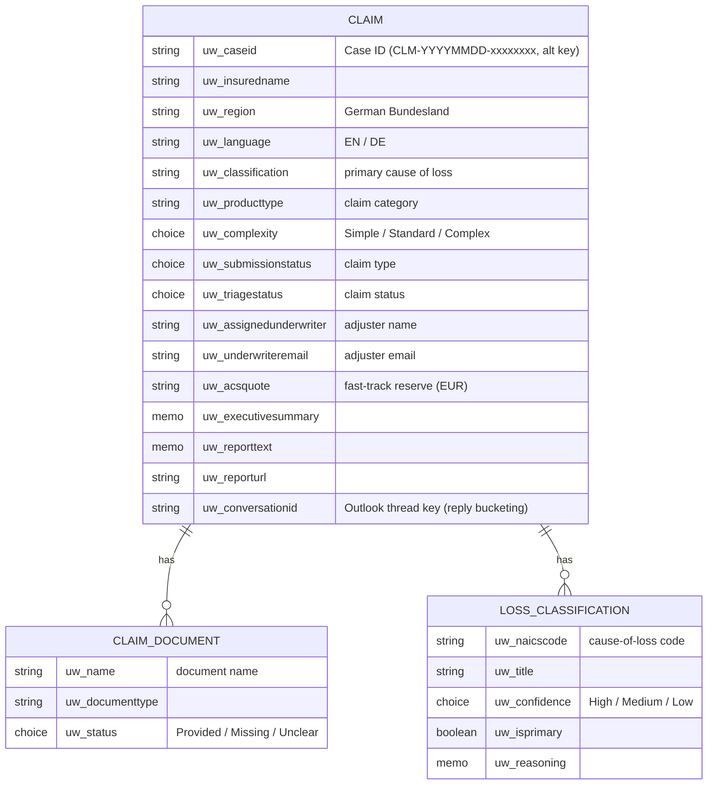
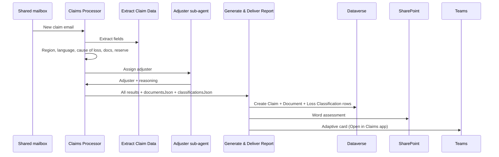

# Architecture

## Components

| Layer | Component | Schema / ID | Purpose |
| --- | --- | --- | --- |
| Agent | Contoso Reinsurance Claims Processor | `cr932_uwSubmissionProcessor` | Orchestrates triage end to end |
| Agent | Claims Adjuster Assignment Agent | `cr932_underwriterAssignmentAgent` | Assigns an adjuster (caseload + region/language + Outlook) |
| AI | Extract Claim Data | `c3333333-…` | Prompt that extracts structured fields from the email |
| Flow | Generate & Deliver Report | `a1051330-…` | Dataverse rows + Word to SharePoint + Teams card |
| Flow | Send Missing Docs Email | `b2051330-…` | EN/DE missing‑document request to the notifier |
| Flow | When a new email arrives (shared mailbox) | added in setup | Inbound trigger from the claims shared mailbox |
| Data | Claim | `uw_submission` | Parent claim record |
| Data | Claim Document | `uw_submissiondocument` | One row per document, Provided/Missing/Unclear |
| Data | Loss Classification | `uw_classificationmatch` | Top‑3 cause‑of‑loss matches, one primary |
| App | Contoso Reinsurance Claims | code app (`/app`) | React + TypeScript adjuster workbench |

> The internal schema names keep the original `uw_` / `cr932_` prefixes on purpose. Renaming
> them would break the flow bindings and table relationships; only the **display names and
> content** were changed to the claims domain. This is why you still see `uw_submission`
> under the hood while the table reads as **Claim** everywhere in the UI.

## Data model

## Design decisions

**Single environment.** The original design wrote the Dataverse rows to a *second*
environment via `CreateRecordWithOrganization`. Those calls were repointed to the same
environment the agent runs in, so the whole solution deploys and runs in one place.

**Domain rebrand without schema churn.** Submission → **Claim**, Underwriter → **Adjuster**,
NAICS business class → **Cause of Loss**, ACS auto‑quote → **Fast‑Track Reserve Estimate**,
Case ID prefix `UW-` → `CLM-`, currency CAD → **EUR**. Display names and all content changed;
logical/schema names kept.

**Germanisation.** Canadian provinces became German *Bundesländer*; the missing‑docs email's
French branch became **German**; language detection is **DE/EN** (and reports any other
detected language while corresponding in EN). The agent itself always converses in English.

**Trigger added via the UI.** Copilot Studio event triggers don't bind reliably to the agent
when hand‑authored in the solution XML, so the inbound shared‑mailbox trigger is added in
Copilot Studio during setup, where the binding, flow and connection are generated correctly.

**Reply threading and deterministic extraction.** A planned upgrade adds reply bucketing (a
follow‑up email attaches to its existing claim via `uw_conversationid`) and moves extraction
into the trigger flow as two AI Builder prompts — one for emails with attachments, one for
body‑only — with the attachment inventory read from the Outlook connector rather than the
model. The column ships in solution 1.0.0.6; the flow rewire is documented separately. See
[Threading-and-Extraction.md](Threading-and-Extraction.md).

## Sequence (happy path)

