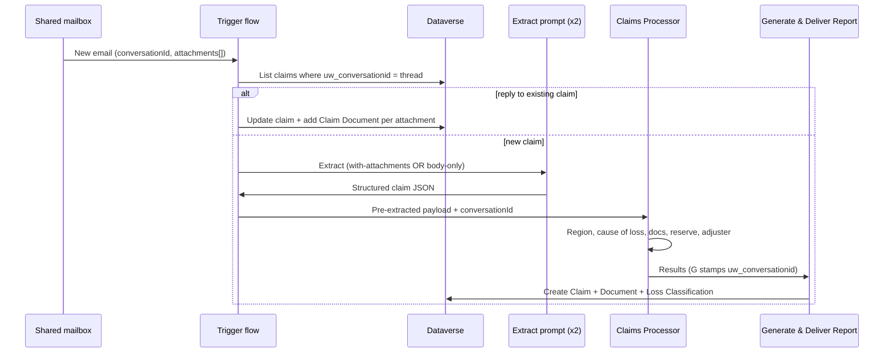

# Reply threading and deterministic extraction

This is the design for two upgrades to the inbound pipeline:

1. **Reply bucketing** — a follow‑up email on an existing thread attaches to the claim it belongs to instead of spawning a duplicate.
2. **Deterministic extraction** — the trigger flow runs the extraction itself, choosing one of two AI Builder prompts based on whether the email carries attachments, then hands a clean payload to the agent.

Both are staged in source but not yet applied to the live flow — the inbound trigger is published and running, so the rewire is meant to be done with someone watching it process a test email. The reference flow definition lives in [../solution/triggers/ClaimsInboundWithBucketingAndExtraction.flow.json](../solution/triggers/ClaimsInboundWithBucketingAndExtraction.flow.json).

## Where the idea came from

The [PowerRobin RequestResponder](https://github.com/PowerRobin/Samples/tree/main/RequestResponder) sample threads replies by syncing a shared mailbox into Dataverse with **server‑side sync** — a Queue points at the mailbox, the linked Mailbox record is approved, and every inbound mail lands as an *email activity* that the platform clusters by conversation. It works, but the unit of storage there is the email‑activity timeline.

Our solution stores a **Claim row** (`uw_submission`), built by the Generate & Deliver Report flow. So the bucket we care about is the claim, not an activity feed. The flow‑based approach below keeps that model and gives the same outcome: one thread, one claim.

## Bucketing by conversation id

The Office 365 Outlook trigger already returns `conversationId` (and `internetMessageId`) on every mail. That is the thread key.

A new column carries it on the claim:

| Column | Type | Purpose |
| --- | --- | --- |
| `uw_conversationid` | text (500), searchable + filterable | Outlook conversation id of the originating email |

The column is added to the Claim table in `build/customizations.xml` and ships from solution version **1.0.0.6** onward.

Flow logic, first thing after the trigger:

```
List rows  uw_submissions  where uw_conversationid eq <conversationId>  top 1
   ├── match found  → REPLY:   attach to the existing claim
   └── no match     → NEW:     run extraction, create a new claim
```

On the **reply** path the flow updates the existing claim (append the reply body, move triage to *In Review*) and adds one Claim Document row per new attachment. Nothing new is created at the claim level, so the adjuster keeps working a single record as the conversation grows.

On the **new** path the report flow stamps `uw_conversationid` on the claim it creates. That stamp is what lets the *next* reply find its home.

> The attachment list on the reply path comes straight from the trigger's `attachments[]` array. The platform tells us exactly what arrived — no inference involved.

## Deterministic extraction with two prompts

Today extraction is *step 1 of 10* inside the agent's generative orchestration: the agent decides when to call the `Extract Claim Data` prompt, then reasons through region, cause of loss, documents, reserve and adjuster. That is flexible but not deterministic, and the agent's read of "what was attached" is a guess.

The change moves extraction into the flow and splits the prompt in two:

| Email | Prompt | Inputs |
| --- | --- | --- |
| Has attachments | **Extract — with attachments** | subject, body, sender, received date, attachment names/types/text |
| No attachments | **Extract — body only** | subject, body, sender, received date |

The branch is driven by the connector's `Has Attachment` flag, not by the model. Each prompt is narrower than a single do‑everything prompt, so there are fewer empty fields to invent. The body‑only prompt has no attachment slots at all.

The robustness win is the same point made above: the **attachment inventory is read from the Outlook `attachments[]` array**, so the document check compares the claim against the real set of files rather than the model's recollection of them.

## Hybrid orchestration

Extraction and bucketing move to the flow; the knowledge‑grounded reasoning stays in the agent.



Pushing *everything* into the flow was considered and rejected: it would strip out the knowledge sources and the adjuster sub‑agent, which are the parts doing the grounded judgement. The hybrid keeps determinism where it pays off and keeps the agent where it earns its keep.

## Build order

1. **Import** solution **1.0.0.6** (adds `uw_conversationid`). Confirm the column on the Claim table.
2. **Author the two AI Builder prompts** in the same environment. Clone the existing `Extract Claim Data` prompt; trim one to body‑only, extend the other with an attachments input. Note both model ids.
3. **Edit the inbound trigger flow** (the agent‑bound one) following [ClaimsInboundWithBucketingAndExtraction.flow.json](../solution/triggers/ClaimsInboundWithBucketingAndExtraction.flow.json): add the List‑rows lookup and the reply/new branch, drop in the two extract prompts, and pass `conversationId` through to the agent.
4. **Teach Generate & Deliver Report** to accept `uw_conversationid` and write it on the claim. Add a `conversationId` input to its manual trigger and bind it on the Create row step.
5. **Test** with three mails on one thread: the first creates a claim; the next two attach to it. Then a separate thread to confirm it opens its own claim.

Steps 3–5 touch the live published flow, so run them against a test thread with the run history open.

## What this does not change

The data model elsewhere, the rebrand, the German handling, the report output and the code app are all untouched. `uw_conversationid` is additive; existing claims simply carry an empty value until a threaded email updates them.
